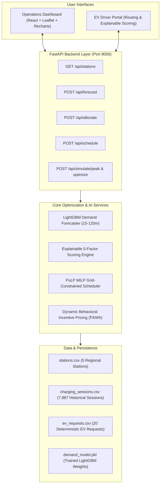
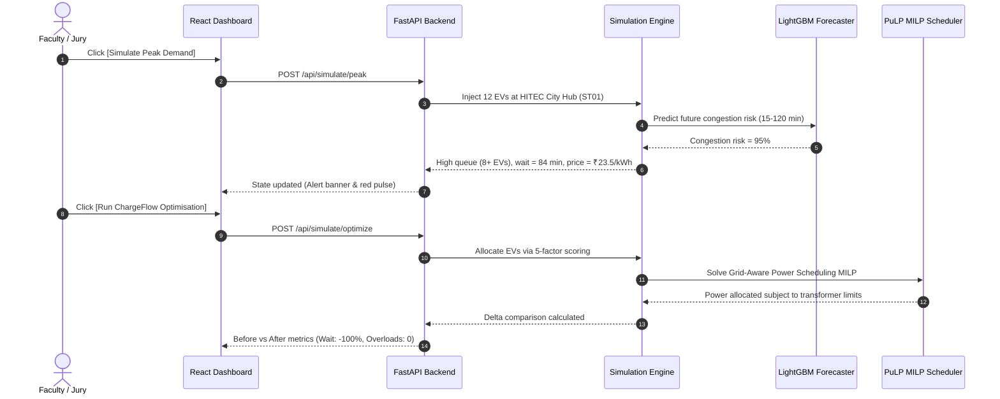

# ChargeFlow AI — System Architecture & Workflow

## System Architecture

```mermaid
graph TD
    subgraph Clients["User Interfaces"]
        UI1["Operations Dashboard (React + Leaflet + Recharts)"]
        UI2["EV Driver Portal (Routing & Explainable Scoring)"]
    end

    subgraph API["FastAPI Backend Layer (Port 8000)"]
        E1["GET /api/stations"]
        E2["POST /api/forecast"]
        E3["POST /api/allocate"]
        E4["POST /api/schedule"]
        E5["POST /api/simulate/peak & optimize"]
    end

    subgraph Engines["Core Optimization & AI Services"]
        M1["LightGBM Demand Forecaster (15-120m)"]
        M2["Explainable 5-Factor Scoring Engine"]
        M3["PuLP MILP Grid-Constrained Scheduler"]
        M4["Dynamic Behavioral Incentive Pricing (₹/kWh)"]
    end

    subgraph DataStore["Data & Persistence"]
        D1["stations.csv (5 Regional Stations)"]
        D2["charging_sessions.csv (7,987 Historical Sessions)"]
        D3["ev_requests.csv (20 Deterministic EV Requests)"]
        D4["demand_model.pkl (Trained LightGBM Weights)"]
    end

    UI1 <--> API
    UI2 <--> API
    API --> Engines
    Engines --> DataStore
```

## Demo Simulation Workflow

```mermaid
sequenceDiagram
    autonumber
    actor Judge as Faculty / Jury
    participant Dashboard as React Dashboard
    participant API as FastAPI Backend
    participant Sim as Simulation Engine
    participant ML as LightGBM Forecaster
    participant PuLP as PuLP MILP Scheduler

    Judge->>Dashboard: Click [Simulate Peak Demand]
    Dashboard->>API: POST /api/simulate/peak
    API->>Sim: Inject 12 EVs at HITEC City Hub (ST01)
    Sim->>ML: Predict future congestion risk (15-120 min)
    ML-->>Sim: Congestion risk = 95%
    Sim-->>API: High queue (8+ EVs), wait = 84 min, price = ₹23.5/kWh
    API-->>Dashboard: State updated (Alert banner & red pulse)

    Judge->>Dashboard: Click [Run ChargeFlow Optimisation]
    Dashboard->>API: POST /api/simulate/optimize
    API->>Sim: Allocate EVs via 5-factor scoring
    Sim->>PuLP: Solve Grid-Aware Power Scheduling MILP
    PuLP-->>Sim: Power allocated subject to transformer limits
    Sim-->>API: Delta comparison calculated
    API-->>Dashboard: Before vs After metrics (Wait: -100%, Overloads: 0)
```
